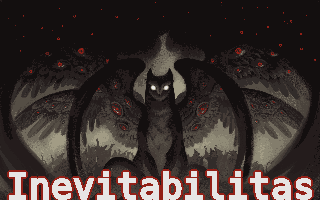

# Inevitabilitas



the MS-DOS videogame

## uhm.. Hi!~

I just wanted to make a game and when the bare minimum was reached I started to build on that. So here we are.

## Installation

Until a install/ startup script done the game is started by manually launching the game with DOSBox.

1. Install [DOSBox](https://www.dosbox.com/index.php) (MS-DOS Emulator)

2. Get [this specific fork of LoveDos](https://github.com/SuperIlu/lovedos
) 

3. Get [Inevitabilitas source](https://github.com/sepes/Inevit) to the same folder with love.exe


4. Open love with dosbox using Inevitabilitas as a parameter
 	```
    mount c [path-to-lovedos-folder]
    c
    love Inevit
    ```

> Note: I encountered a problem with the lovedos folder. I had to mount a folder above it and then navigate there with dos `cd lovedos`

> Tip: It was rather easy to make a script to do the 4. part in one click.
```
    #!/bin/bash
dosbox -conf dosbox.conf -c "mount c [path-to-lovedos-folder]" -c "c:" -c "love Inevit" -c "exit" -exit
```
> `-c "exit" -exit` 
>Closes dosbox after the game exits.


## AI usage note

AI has been used to search love/lua/dos documentation

No code or assets has been generated.